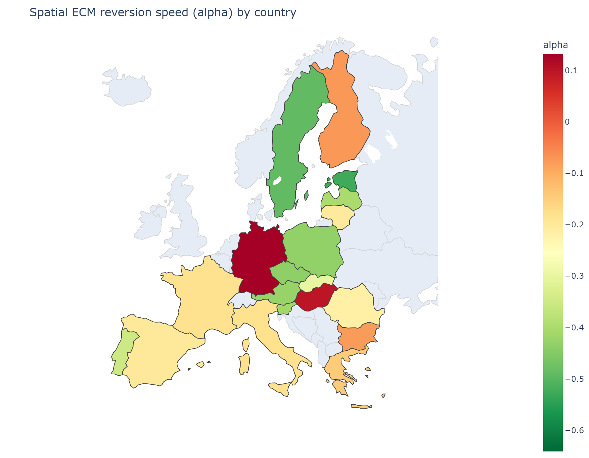
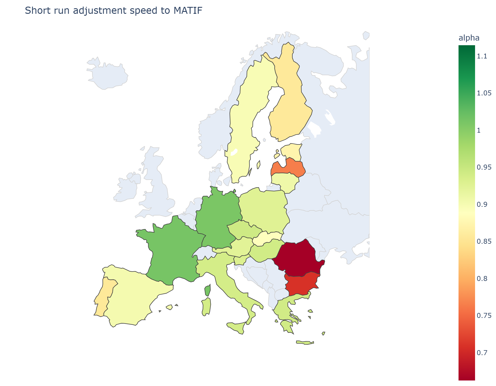
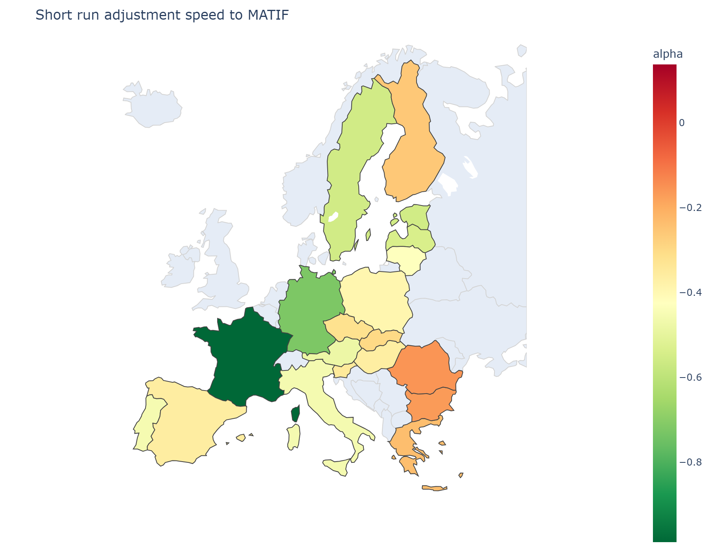

# Model

This project looks at the basis in European wheat markets. First from the perspective of how closely a country's basis moves with its neighbours' (and, as discussed below, in effect how local price movements co-move spatially), and then by looking at how the long-run basis behaves against MATIF and what short-run deviations from that long-run relationship look like across countries.

This is done using two separate frameworks:

1. **A spatial co-movement model for European wheat**, focusing on basis co-movement and market integration. It uses a spatial weight matrix to study how basis co-moves between European countries for bread-making quality wheat, using data from the European Commission on prices and trade flows, as well as MATIF prices.
2. **A temporal model of how fast different European markets adjust to MATIF prices**, and what their long-run relationship to MATIF looks like (how large the long-run basis is, and how short-run deviations from it are corrected). This lets us see, for example, how large the basis is for different countries in a long-run sense, and how deviations from that stable basis point are corrected over time, including the ability to compute hedge ratios.

The two models are related but distinct: the first asks how strongly a country's basis is tied to its trade-weighted neighbourhood, with no notion of time or speed; the second asks how quickly a country's price returns to its own long-run relationship with MATIF specifically. A country can, in principle, score very differently on each and, as the results below show, largely does.

## Background and Mission

This analysis builds on an earlier spatial disequilibrium [project](https://github.com/bitbergDA/Wheat-Disequilibirum-analysis), where I examined how the error term of a spatial lag model differs between countries, and compared it to the mean error term across all countries to construct a Spatial Disequilibrium Index (SDI). Since mean reversion was present in this SDI, I also tested whether the variable had predictive power, which turned out to be the case.

On further investigation, I found that analysis lacking in both method and data in certain areas, which motivated this newer project. On revision, I also concluded that the analysis would be far more useful framed through the lens of *basis*, since many wheat market participants across Europe hedge against MATIF but, because of transportation costs and storage economics, still face real basis risk.

To address this, I built the two separate analyses described above. Together, they're intended to help farmers and farmer-associated cooperatives manage basis risk and hedging, and to make off-market offloading decisions easier — by giving a clearer sense of what the basis "should" look like in a given country, and how quickly any deviation from that long-run basis is likely to correct. This provides a fuller picture of the basis risk involved in hedging against MATIF, which can inform storage decisions, and can also help in more effectively identifying off-market buyers and sellers depending on the current price situation — since, as this analysis shows, the relationship between local price and MATIF appears to differ meaningfully across countries and across time.

The analysis proceeds by first presenting the spatial model of basis, then the temporal model, and finally discussing the combined findings.

## Spatial Co-movement Analysis

### Theory

Looking at the relationship between basis in different countries that share the same hedge market (MATIF) is, in effect, just looking at local price co-movement. Basis is defined as:

$$
Basis_i = LocalPrice_i - MATIF_{price}
$$

The basis difference between two countries then reduces to:

$$
Basis_A - Basis_B = (LocalPrice_A - MATIF_{price}) - (LocalPrice_B - MATIF_{price}) = LocalPrice_A - LocalPrice_B
$$

So the theory of spatial price equilibrium and the law of one price is what should drive this basis difference. Prices for the same commodity should, in theory, converge to the point where the remaining difference equals the cost of transportation. This is easiest to see in a world with only two countries: if the equilibrium price in country A is below the equilibrium price in country B by more than the transportation cost, trade should occur until prices converge such that the price in A equals the price in B minus the transportation cost — a spatial equilibrium between the two markets.

In reality, of course, you have a web of countries with different supply and demand curves operating simultaneously, producing different prices and different rates of price change, each with different transportation costs between them. To complicate things further, some countries act as hubs for others, creating an entire network between markets rather than a simple pairwise relationship. There are also temporal complications, such as storage economics, where market participants can speculate and store goods to sell at more advantageous times. All of this creates the complex mix of factors that together determine the price of wheat, and that market operators have to navigate.

### Data

For this analysis I use data from the [European Commisions Agri-food data portal](https://agridata.ec.europa.eu/extensions/DashboardPrice/DashboardMarketPrices.html) for country-specific wheat prices going back to January 2005, expressed monthly and in euros, together with trade flows of wheat between European countries over the same period which i retrive from [European Data portal](https://data.europa.eu/data/datasets/vt5w0kors8bqhl2kizqga?locale=en). This data had missing values however, so I therefore filled a small amount in with previous results, and also decided to not include 3 countries from the dataset.

To avoid confusing global macro price events with regional deviations in wheat prices, I extract the MATIF price component from local prices, which simultaneously defines the basis, the "local" part of a country's price movement, once the global price component has been removed. MATIF price data which I get from [Investor.com](https://www.investing.com/commodities/milling-wheat-n2-historical-data), and is defined as the rolling future price of MATIF data

To then establish the relationship between countries, I construct a gravity-fitted spatial weight matrix, regressing trade flow on geographical distance and whether two countries share a navigable river, specifically to avoid the endogeneity problems that come from using realized trade flow directly. These geographic factors explain trade flow well and got a pseudo $$R^2$$ result of 0.97, and the fitted friction coefficients are robust to whether export or import flow is used to fit them. Though this robustness is about the geographic friction structure specifically, not a claim that trade between any given pair of countries is symmetric. Realized trade volumes are frequently asymmetric.

Since the analysis here is monthly, all reported speed-of-adjustment figures,  both in this model and in the temporal model below should be read as "share of deviation corrected per month," not per week or per day. This matters for how fast a given coefficient should be interpreted as being in practical, storage-decision terms.

### Method

I use a spatial lag panel regression to build this model. This is possible directly, without a cointegration or error-correction step, because basis for every country in the sample tested as I(0). Meaning that the local price and MATIF share a common stationary relationship, so there's no unit-root problem to work around before estimating the equation. (This is different from the temporal model below, where local price and MATIF are each individually non-stationary on their own, and a full error-correction structure is required.)

The model looks at how the basis in a given country relates to the spatially-weighted basis of all other countries, including a country-specific fixed effect and a dummy for the period when the war in Ukraine began:

$$
y_{i,t} = \beta_0 + \beta_1 Wy_{i,t} + \sum_i \theta_i \cdot FixedEffect_i + \delta \cdot UkraineWar_t + \mu_{i,t}
$$

where $y$ is the basis, $W$ is the gravity-fitted spatial weight matrix, $\theta_i$ are country-specific fixed effects, and $\delta$ is the coefficient on the Ukraine war period dummy.

### Results

The pooled $\beta_1$ is estimated at 0.945, which makes intuitive sense: it states that if the spatially-weighted basis of a country's neighbourhood moves by 1 euro, that country's own basis moves by roughly 0.94 euro in the same period. The coefficient is highly significant, with a 95% confidence interval of [0.80, 1.08]. Co-movement with neighbours is, on average, strong. A poolability test between the countries was made and came back sucessfull with a p-value of 0.00, and a F-statistic of 107.84. 

I also estimated $\beta_1$ separately for each country, shown in the map below:



Countries closer to where the MATIF market is located, such as Spain, Germany, and France co-move *less* with their neighbours' basis than the pooled average would suggest. Countries further from MATIF show substantially stronger co-movement with their spatially-connected markets.

## MATIF Basis Analysis Model (Temporal Model)

### Theory

This second model takes a temporal perspective, using MATIF as the common reference market. The basis is the difference between the local physical wheat price and the MATIF futures price. In a frictionless market, this difference should track the cost of transporting and handling wheat between the local market and the MATIF reference point. In practice, storage costs, expectations, market frictions, contract structures, and local supply-and-demand differences all cause the basis to deviate from that simple relationship.

### Data

This uses the same monthly price data as the spatial model above. Since this model doesn't require a spatial weight matrix, trade flow data isn't used here.

### Method

An error-correction model is needed here, since neither the local price nor the MATIF price is individually stationary at I(0) but, since basis itself is stationary, there's a strong prior that the two are cointegrated, which formal testing confirms. I therefore use a two-step error-correction approach: first capturing the long-run relationship between local price and MATIF price (often referred to, in financial terms, as the hedge ratio), then using that relationship to estimate how short-run deviations from it are corrected.

**Long-run model:**

$$
y_{i,t} = \beta_0 + \beta_1 X_{i,t} + \sum_i \theta_i \cdot FixedEffect_i + \mu_{i,t}
$$

**Short-run model:**

$$
dy_{i,t} = \beta_0 + \beta_1 \mu_{i,t-1} + \beta_2 dX_{i,t-1} + \beta_3 dX_{i,t-2} + \sum_i \theta_i \cdot FixedEffect_i + \delta \cdot UkraineWar_t + \epsilon_{i,t}
$$

Here $y$ is the local price, $X$ is the MATIF price, and $d$ denotes the first difference. $\mu_{i,t}$ is the residual from the long-run relationship; its lagged value is the error-correction term, capturing how far the local price was from its estimated long-run relationship with MATIF in the previous period. The coefficient on this term measures the speed at which that deviation is corrected.

### Results

For the long-run model, the pooled $\beta_1$ is 0.89: a 1 euro increase in MATIF is associated with, on average, a 0.89 euro increase in local price across countries. This pooled figure isn't volume-weighted, so it's more informative to look at it as the within-country mean basis, shown below:



France has a long-run basis of essentially 0% relative to MATIF, which is expected given MATIF settles there. Germany, its neighbour, also shows a very low long-run basis. Romania and Bulgaria, by contrast, show substantially larger long-run bases around 34% for Romania and 30% for Bulgaria.

For the short-run model, the coefficient of interest is $\beta_1$ on the lagged error-correction term — the speed of adjustment, or how quickly the model corrects a deviation from the long-run relationship. The pooled speed of adjustment is around −0.29, meaning roughly 29% of a disequilibrium created in the previous month is corrected within the current month. This varies substantially by country, shown in the map below:



France's speed of adjustment is close to −1. Meaning it corrects essentially the full previous month's deviation within a single month. Germany's is also high, followed by Sweden. At the other end, Bulgaria and Romania correct only around 15% of any basis deviation per month on average, implying a half-life of roughly four months for a typical disequilibrium to close by half, compared to under a month for France.

## Discussion

Looking at the temporal model first: a lower long-run basis in a country is almost always associated with a higher speed of adjustment. This appears spatially tied to proximity to the MATIF market — countries closer to it show both a lower basis and faster correction of any deviation. This is consistent with the law of one price: two markets (the local market and MATIF) should only be able to differ by an amount close to the transportation cost between them, so lower transport cost implies both a smaller structural basis *and* faster correction, since lower transport cost is generally associated with shorter transport time, meaning any deviation, and any resulting spatial arbitrage is absorbed more quickly.

Looking at the spatial model, a genuinely interesting (and at first glance counterintuitive) pattern emerges: countries close to MATIF are, in relative terms, *not* strongly co-moving with their neighbours' basis, while countries further from MATIF co-move with their neighbours substantially more. (Note that the spatial model has no time dimension, so no directional causality can be established here. only association.) One plausible explanation is that countries very close to MATIF use it more frequently and directly, meaning there are more established structural habits and systems tying their local markets to MATIF specifically, rather than to other markets in their immediate geographic area.

Put together, this suggests two different profiles of countries: those primarily tied to MATIF (especially where MATIF is geographically close), and those primarily tied to their neighbours' basis through local price co-movement.

**This two-profile pattern should currently be treated as a hypothesis rather than a fully confirmed result.** Because basis in the spatial model is constructed by subtracting MATIF from local price, and the temporal model separately measures how much of local price MATIF explains, the two models are not fully independent of each other: a country with strong MATIF pass-through mechanically has less residual variance left in its basis for the spatial model to explain, regardless of whether there is a genuine economic trade-off between the two channels. This has not yet been ruled out as an alternative explanation for the pattern above. The relevant check, rebuilding the spatial model using raw, unadjusted local price rather than basis, and confirming the anti-correlation between the two models' country-level coefficients survives, is a priority for future work before this pattern is treated as a confirmed structural finding.

This distinction is still practically useful even in its current, hypothesis-stage form. A farmer hedging on MATIF over longer periods while holding stored grain in Sweden, for instance, can use the temporal model's estimated adjustment speed directly: if the Swedish basis widens, the model suggests that deviation should correct relatively quickly. A farmer in Bulgaria, facing the same situation, should expect a much slower correction. Separately, a Swedish farmer watching a sharp shift in neighbouring countries' basis can use the spatial model to gauge how much of that is likely to spill into their own basis. Which in Sweden's case woulb be, not very much; in Bulgaria's case, a great deal.

## Limitations

- **The two-profile pattern (above) is not yet confirmed independent of how basis was constructed.** This is the most important open question in the current analysis and should be resolved before the finding is presented as structural rather than exploratory.
- **Non-euro member states carry an additional FX component in their basis** that euro-area members do not, since MATIF is EUR-denominated. Several of the countries showing the largest long-run basis and slowest adjustment (Romania, Bulgaria) are also non-euro, so part of what looks like basis risk may be currency risk rather than pure commodity market friction.
- **The spatial weight matrix only captures intra-EU trade infrastructure.** Countries with significant non-EU trade outlets — Bulgaria and Romania via Black Sea ports, in particular — have a real price-correction channel (export demand from outside the EU) that this model structurally cannot observe, which may explain some of their apparent slowness to correct within the modeled network.
- **Storage economics and financial hedging are plausible alternative correction channels that this analysis cannot test directly.** A country's basis could be absorbed through inventory adjustment (storing rather than trading) or through direct financial hedging against MATIF (rather than physical trade) instead of the price-correction channel this model measures. Both are consistent with observing real, well-measured disequilibrium that doesn't correct through the modeled channel, and both are worth flagging as open questions rather than assuming price/trade correction is the only mechanism at work.
- **Both models use pooled coefficients as headline figures alongside country-specific ones**; where a formal poolability test rejects the pooled specification, the country-level results should be treated as the primary finding rather than the pooled average.

## Conclusion

Different European wheat markets and their corresponding basis appear to fall into different categories: some tied closely to MATIF, others tied more closely to their neighbouring markets. There may be a structural trade-off here — long-standing systems and contract relationships that shape how basis moves differently depending on a country's geographic proximity to MATIF — which partly ties back to the law of one price. The spatial pattern is also consistent with the gravity-based structure used to build the spatial weight matrix: many countries appear to gravitate toward a shared centroid (MATIF) in terms of basis movement, but as that gravitational pull weakens with distance, countries appear to gravitate more toward their neighbours instead, producing the geographic pattern observed above. Overall, most countries appear at least somewhat tied to both MATIF and their neighbours, even as the balance between the two differs meaningfully by country — though, as noted above, disentangling how much of that balance is a real economic trade-off versus an artifact of how basis was constructed remains the key open question for this analysis.


---

# Repository Structure

```text
├── data/
│   ├── raw/ <- In here i put the raw data, for wheat prices locally which can be found here (https://agridata.ec.europa.eu/extensions/DashboardPrice/DashboardMarketPrices.html#), and closet rolling future MATIF prices from Investor.com .
│   └── processed/ <- All processed data got saved here
├── src/
│   ├── forecasted_input/ <- I used this to handle the data, allign it, but also retrive flow data from API's
│   ├── model/ <- this is where the different models where used, as well as maps constructed       
│   ├── output/ <- here is where the maps where saved.
└── README.md
